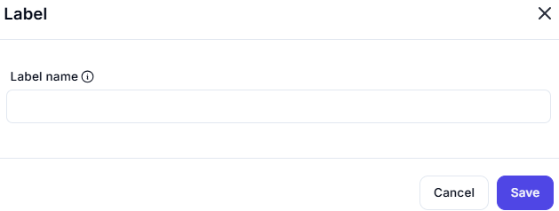

# Label

## Description:

**Label Name**:

- A placeholder indicator for text input
- Alternatively, it might represent:
  - A default label number (Label #1)
  - A required field indicator
  - A special character placeholder in the UI

---

## Functions

This interface allows users to:

1. Create a new label
2. Edit an existing label's name
3. Manage label properties

---

**Recommendations**:

- Consider adding tooltips to buttons
- Include character limits for label names
- Add validation feedback for invalid names
