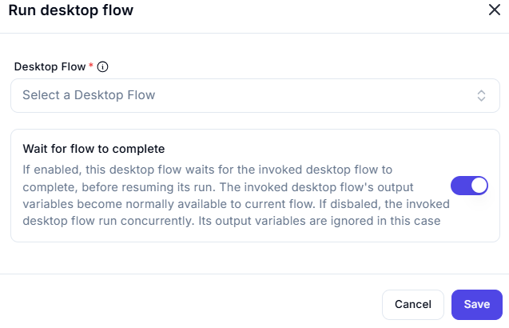

## Run Desktop Flow

### **Function:**

Executes a **Desktop Flow** (Power Automate for Desktop) from within a cloud flow.

---

### Configuration:

- **Desktop Flow (required)**: Select the desktop flow you want to trigger.
- **Wait for flow to complete (toggle)**:
  - **Enabled (default)**: The cloud flow waits until the desktop flow finishes execution.
    - All **output variables** from the desktop flow become available to the cloud flow.
  - **Disabled**: The desktop flow runs **concurrently** (asynchronously).
    - Output variables from the desktop flow will **not** be returned to the cloud flow.

---

### Use Case:

Use this action when you need to:

- Run **desktop automation tasks** such as interacting with legacy software.
- Integrate **robotic process automation (RPA)** with your cloud processes.

---

### Best Practice:

Enable “Wait for flow to complete” when you need to:

- Use **data output** from the desktop flow in subsequent cloud flow steps.
- Ensure that dependent logic only executes **after** the desktop flow finishes.

---

> _Note:_ Ensure that the environment has an active **Power Automate Desktop agent** configured to run desktop flows.
