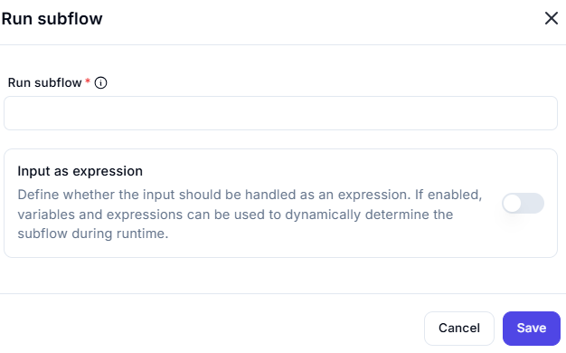

# Run Subflow

## Description

Here we can call child flows or subflow to be executed

---

When enabled:

- Allows dynamic subflow determination at runtime
- Supports variables and expressions as input
- Provides flexibility in workflow execution

---
