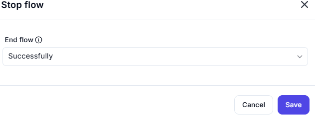

# Stop Flow

## Functionality

- Immediately terminates the current workflow
- Optional success flag for monitoring/auditing
- Typically used for:
  - Planned exits
  - Error recovery
  - Conditional termination

---

### Stop flow drop down options:

- Successfully  
  _(Checkbox to indicate successful termination)_
- With Error Message
  _(Checkbox to indicate It will show failure with error message)_
