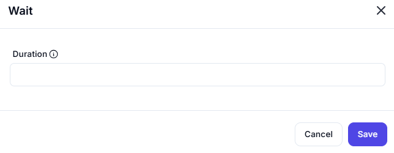

# Wait 

## Function
- Pauses workflow execution for specified duration
- Common uses:
  - Rate limiting
  - Scheduled delays
  - Polling intervals

## Inputs
**Duration**: []  
*(Input field for time specification - e.g., seconds/minutes/hours)*

