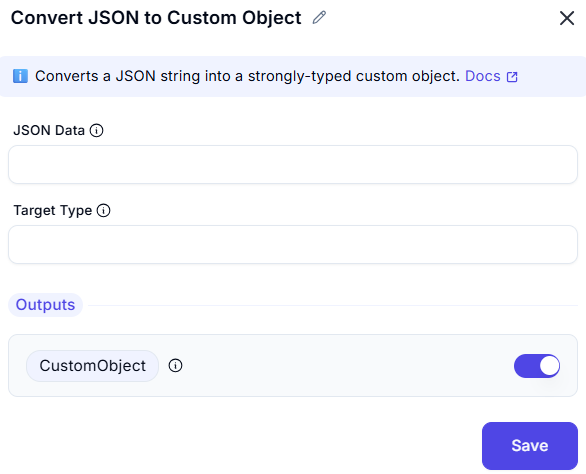

## Convert JSON to Custom Object

This form allows users to input a JSON string and convert it into a custom object or list structure, suitable for further automation or data manipulation tasks.


---

### JSON Input

- **Field Name:** `JSON`  
- **Type:** Multi-line Text Field  
- **Tooltip Icon (ⓘ):** Provides guidance or format expectations for the JSON input.
- **Purpose:** Paste or type a valid JSON string that you want to convert into a custom object.
- **Example:**
  ```json
  [
    { "id": 1, "name": "Alice" },
    { "id": 2, "name": "Bob" }
  ]

### Output Section

- **Output Variable: JsonAsCustomObject**
This is a toggle-enabled output assignment.
The variable will store the resulting custom object derived from the input JSON.

### Use Case

Use this tool when:

- You need to parse raw JSON data into a structured format.

- You're integrating APIs or external data sources into your workflow.

- You want to easily access fields and iterate over JSON data programmatically.

