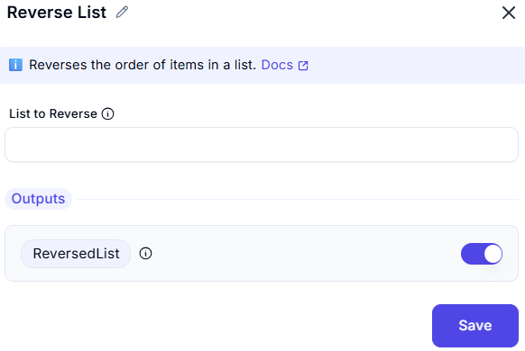

## Reverse List 

The **"Reverse list"** form allows users to input a list variable and reverse the order of its elements. This feature is typically used in automation workflows or data processing pipelines.

---

### Field Description

- **List to reverse** `*`
  - This is a **required input field**.
  - You must specify the name of the list (e.g., `%MyList%`) that you want to reverse.
  - The field includes a **tooltip icon** (ⓘ) next to the label, which usually provides additional guidance on acceptable formats or usage tips.
  - Only one list can be entered at a time.

---

### Use Case

Reversing a list is useful when:
- You want to process items from last to first.
- Sorting operations need to be undone.
- You are manipulating sequences (like logs, queues, or batches) where order matters.

This interface provides a clean, minimal setup, ensuring users can quickly apply the reverse operation with minimal configuration.

