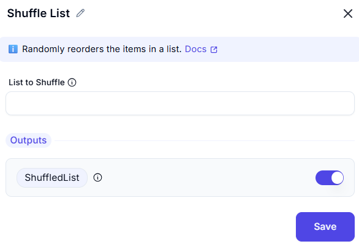

### Shuffle List 

This UI component allows the user to shuffle a list of items by providing a list variable.

**Fields and Actions:**

- **List to shuffle**:  
  - Required input field.  
  - Accepts a list variable (e.g., `%List%`).  
 
### Purpose

This interface is commonly used in automation tools, such as bots or workflow builders, where you need to:

- Randomize items in a list.
- Avoid processing items in the same sequence every time.
- Add variety or fairness (e.g., selecting users in random order).

The design ensures the process is simple, with minimal input needed — just specify the list and hit **Save**.
 