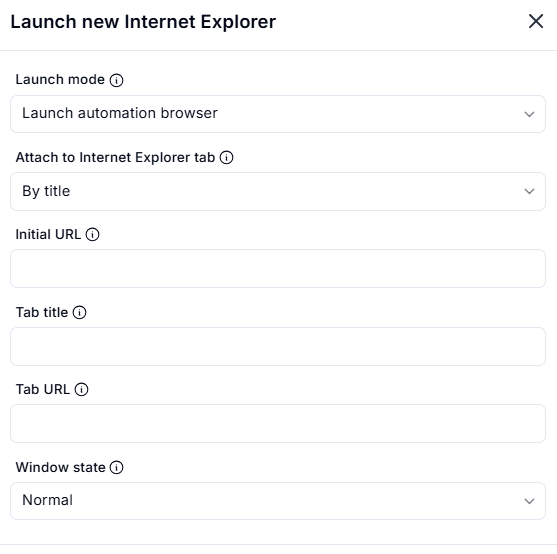

# Launch New Internet Explorer  

## Description

This feature allows users to launch a new instance of Internet Explorer or attach to an existing tab. It includes options to configure the launch mode, initial URL, tab title, and window state.  

  

## Fields and Options  

### 1. **Launch Mode** 

- Choose how to launch Internet Explorer:  
  - **Launch Automation Browser**: Launch a new instance of Internet Explorer for automation.  
  - **Attach to Internet Explorer Tab**: Attach to an existing Internet Explorer tab.  

### 2. **Attach to Internet Explorer Tab**

- Specify how to identify the tab to attach to:  
  - **By Title**: Attach to a tab based on its title.  
  - **By URL**: Attach to a tab based on its URL.  

### 3. **Initial URL**

- Enter the URL to load when launching a new instance of Internet Explorer.  

### 4. **Tab Title**

- Specify the title of the tab to attach to (if attaching by title).  

### 5. **Tab URL**

- Specify the URL of the tab to attach to (if attaching by URL).  

### 6. **Window State**

- Choose the initial state of the Internet Explorer window:  
  - **Normal**: Open the window in its default state.  
  - **Maximized**: Open the window in a maximized state.  
  - **Minimized**: Open the window in a minimized state.  

## Use Cases

- Launching a new instance of Internet Explorer for automation tasks.  
- Attaching to an existing Internet Explorer tab to continue automation.  
- Configuring the initial URL and window state for better control over the browser session.  

## Summary

The **Launch New Internet Explorer** action provides a way to launch or attach to Internet Explorer with customizable options like launch mode, initial URL, tab title, and window state. It ensures flexibility and control when working with Internet Explorer in automation workflows.