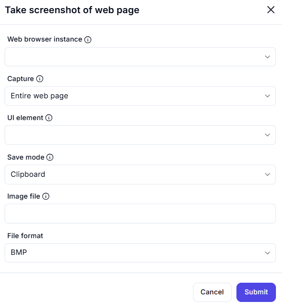

# Take Screenshot of Web Page  

## Description

This feature allows users to capture a screenshot of a web page or a specific UI element within a web browser instance. It supports saving the screenshot to the clipboard or as an image file in various formats.  

  

## Fields and Options  

### 1. **Web Browser Instance**

- Select the web browser instance from which to capture the screenshot.  
- This ensures the action is performed on the correct browser session.  

### 2. **Capture**

- Choose what to capture:  
  - **Entire Web Page**: Capture the full web page, including the visible and non-visible areas.  
  - **UI Element**: Capture a specific UI element on the web page.  

### 3. **UI Element**

- Specify the UI element to capture (if applicable).  

### 4. **Save Mode**

- Choose how to save the screenshot:  
  - **Clipboard**: Save the screenshot to the clipboard for quick pasting.  
  - **Image File**: Save the screenshot as an image file.  

### 5. **Image File**

- Specify the file path and name for saving the screenshot (if saving as an image file).  

### 6. **File Format**

- Select the file format for the screenshot (e.g., `BMP`, `PNG`, `JPEG`).  

## Use Cases

- Capturing screenshots of web pages for documentation or reporting.  
- Saving screenshots of specific UI elements for debugging or analysis.  
- Automating the process of capturing and saving web page visuals.  

## Summary

The **Take Screenshot of Web Page** action provides a way to capture screenshots of web pages or specific UI elements. It supports saving screenshots to the clipboard or as image files in various formats, making it ideal for documentation, debugging, and automation tasks.