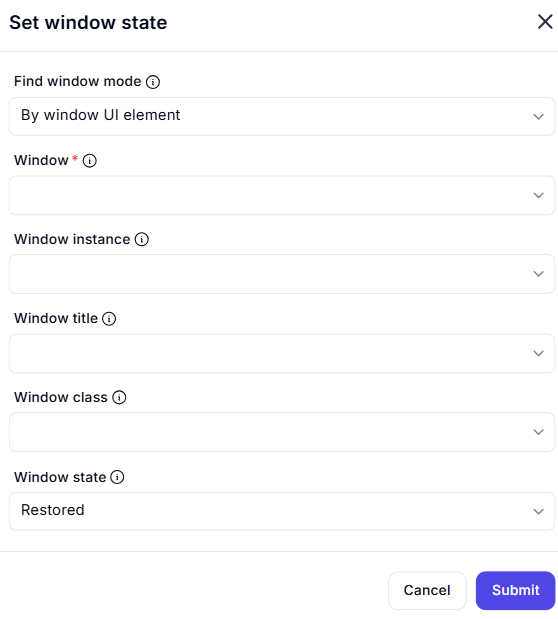

# Set Window State  

## Description  

The **Set Window State** action allows you to change the state of a specified application window, such as minimizing, maximizing, or restoring it.  

  

## Fields and Options  

### **1. Find Window Mode** 

- Determines how the window is identified:  
  - **By window UI element** – Select a window based on a UI element.  
  - **By window title** – Identifies a window using its title.  
  - **By window class** – Uses the window class name for selection.  
  - **By window instance** – Focuses a specific instance of a window.  

### **2. Window** 

- Select the target window from the available UI elements.  

### **3. Window Instance** *(Optional)* 

- Specify the instance of the window to target (useful when multiple instances exist).  

### **4. Window Title** *(Optional)* 

- Enter the exact title of the window to modify.  

### **5. Window Class** *(Optional)* 

- Provide the window class name for precise identification.  

### **6. Window State** 

- Defines the desired state of the window:  
  - **Minimized** – Reduces the window to the taskbar.  
  - **Maximized** – Expands the window to full screen.  
  - **Restored** – Returns the window to its normal size if minimized or maximized.  

## **Use Cases**

- Bringing a background window to the foreground.  
- Minimizing a window to clear screen space.  
- Restoring a previously minimized or maximized window.  

## **Important Notes**

- Some applications may restrict window state changes.  
- Ensure the selected identification method uniquely matches the intended window.  

## **Summary**

The **Set Window State** action provides a way to control application windows, allowing you to automate window behavior based on your workflow requirements.  