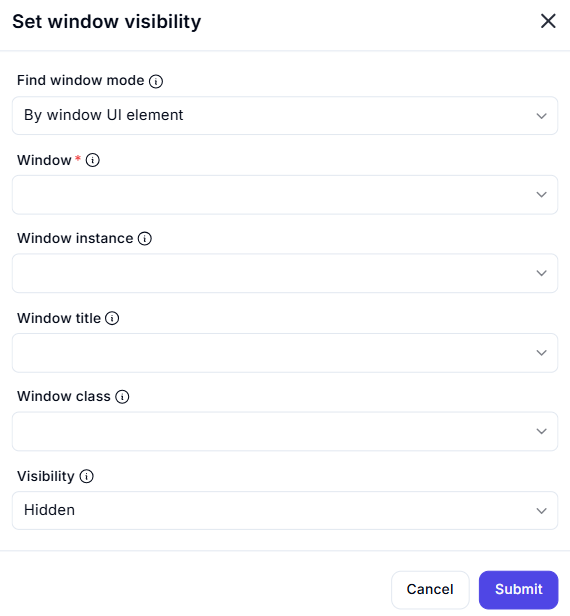

# Set Window Visibility  

## Description

The **Set Window Visibility** action allows you to show or hide a specific application window, making it visible or invisible on the screen.  

  

## Fields and Options  

### **1. Find Window Mode** 

- Determines how the window is identified:  
  - **By window UI element** – Select a window based on a UI element.  
  - **By window title** – Identifies a window using its title.  
  - **By window class** – Uses the window class name for selection.  
  - **By window instance** – Focuses a specific instance of a window.  

### **2. Window** 

- Select the target window from the available UI elements.  

### **3. Window Instance**  

- Specify the instance of the window to target (useful when multiple instances exist).  

### **4. Window Title** 

- Enter the exact title of the window to modify.  

### **5. Window Class** 

- Provide the window class name for precise identification.  

### **6. Visibility** 

- Defines the desired visibility state of the window:  
  - **Visible** – The window will be shown on the screen.  
  - **Hidden** – The window will be hidden from view.  

## **Use Cases**

- Hiding unnecessary windows to declutter the workspace.  
- Bringing a window into view when required.  
- Automating UI workflows that require dynamic window visibility.  

## **Important Notes**

- Some applications may not support hiding or restoring their windows.  
- Ensure the selected identification method uniquely matches the intended window.  

## **Summary**

The **Set Window Visibility** action allows you to control whether a window is visible or hidden, helping you manage UI automation efficiently.  